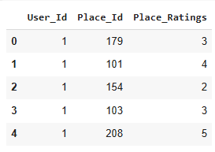
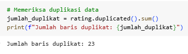

# Laporan Proyek Machine Learning - Ni Gusti Putu Saniskalita Desniari

## Project Overview
<div style="text-align: center;">
  
</div>

Sektor pariwisata merupakan salah satu penggerak utama perekonomian Indonesia yang terus berkembang. Daerah Istimewa Yogyakarta (DIY) dikenal luas sebagai salah satu destinasi wisata unggulan di Tanah Air, berkat kekayaan budaya, sejarah, seni, dan keindahan alamnya yang memikat. Mulai dari Candi Prambanan yang megah, Keraton Yogyakarta yang sarat nilai tradisi, hingga pantai-pantai eksotis seperti Parangtritis, Yogyakarta menawarkan pengalaman wisata yang beragam dan menarik. Namun, banyaknya pilihan destinasi wisata sering kali membuat wisatawan merasa bingung dalam menentukan tempat mana yang paling sesuai dengan minat dan preferensi pribadi mereka.

Dalam era digital seperti saat ini, kebutuhan akan informasi yang cepat, relevan, dan personal semakin meningkat. Oleh karena itu, penerapan **sistem rekomendasi wisata berbasis teknologi** menjadi solusi strategis yang tidak hanya membantu wisatawan dalam memilih destinasi yang sesuai, tetapi juga meningkatkan kualitas pengalaman berwisata secara keseluruhan. Sistem rekomendasi memungkinkan pengguna untuk memperoleh saran destinasi berdasarkan preferensi pribadi, riwayat kunjungan, atau perilaku wisatawan lain yang memiliki kesamaan minat.

Sistem rekomendasi terbukti mampu meningkatkan kenyamanan dan efisiensi dalam pengambilan keputusan. Dalam konteks pariwisata, dua pendekatan utama yang sering digunakan adalah **collaborative filtering** dan **content-based filtering**. Menurut penelitian yang dilakukan oleh Hartatik et al. (2021), algoritma *collaborative filtering* sangat efektif dalam memberikan rekomendasi wisata yang akurat. Algoritma ini bekerja dengan menganalisis perilaku dan preferensi pengguna lain yang memiliki pola aktivitas serupa, sehingga dapat menyarankan destinasi yang kemungkinan besar juga akan disukai oleh pengguna baru ([Hartatik et al., 2021](https://ejournal.uigm.ac.id/index.php/IG/article/download/2695/1767)).

Di sisi lain, pendekatan *content-based filtering* memberikan rekomendasi berdasarkan kesamaan atribut atau konten dari destinasi wisata itu sendiri, seperti kategori tempat (alam, budaya, sejarah), lokasi geografis, atau fasilitas yang tersedia. Penelitian oleh Lestari et al. (2022) menunjukkan bahwa metode ini mampu menghasilkan saran destinasi yang lebih personal dan kontekstual sesuai dengan preferensi pengguna ([Lestari et al., 2022](https://jurnal.pcr.ac.id/index.php/jkt/article/view/5214)). Keunggulan utama dari pendekatan ini adalah kemampuannya untuk tetap memberikan rekomendasi yang relevan meskipun data interaksi pengguna masih terbatas.

Dengan menggabungkan kedua pendekatan tersebut, sistem rekomendasi dapat menjadi lebih tangguh dan adaptif dalam memahami kebutuhan wisatawan. Implementasi teknologi ini sangat potensial untuk diterapkan pada platform wisata digital di Yogyakarta, baik dalam bentuk aplikasi mobile, website, maupun sistem informasi di pusat-pusat informasi turis. Selain meningkatkan kepuasan pengunjung, penerapan sistem rekomendasi juga dapat membantu pemerintah daerah dan pelaku industri pariwisata dalam mengelola arus kunjungan, memperkenalkan destinasi yang kurang populer, serta meningkatkan daya saing sektor pariwisata secara keseluruhan.

## Business Understanding
### Problem Statements
Berdasarkan uraian yang telah dipaparkan pada latar belakang diatas, maka dapat diambil sebuah rumusan masalah yang dirumuskan sebagai berikut:
- Bagaimana membangun sistem rekomendasi wisata yang mampu memberikan saran destinasi secara personal kepada pengguna berdasarkan preferensi sebelumnya?
- Bagaimana memanfaatkan interaksi pengguna terhadap tempat wisata (seperti pemberian rating) untuk meningkatkan kualitas dan relevansi rekomendasi?

### Goals
Berdasarkan rumusan masalah yang telah dipaparkan di atas, maka proyek penelitian ini memiliki tujuan, yaitu:
- Mengembangkan sistem rekomendasi wisata di wilayah Yogyakarta berbasis data pengguna.
- Memberikan saran tempat wisata yang personal dengan memanfaatkan pendekatan content-based filtering dan collaborative filtering.

### Solution Statements
- Menerapkan Content-Based Filtering: Sistem rekomendasi akan memanfaatkan data atribut destinasi wisata di Yogyakarta, seperti kategori wisata (budaya, alam, sejarah, dll), lokasi, dan fitur lainnya untuk memberikan rekomendasi destinasi yang mirip dengan tempat wisata yang pernah dikunjungi atau disukai oleh pengguna. Teknik yang digunakan antara lain cosine similarity pada fitur kategori dan lokasi untuk mengukur kesamaan antar destinasi.
- Menerapkan Collaborative Filtering: Sistem akan membangun model rekomendasi berdasarkan interaksi pengguna dengan destinasi wisata melalui data rating yang diberikan. Metode collaborative filtering, khususnya user-based atau item-based filtering, akan digunakan untuk menemukan pola kesamaan preferensi antar pengguna dan merekomendasikan destinasi yang sesuai berdasarkan preferensi pengguna lain dengan pola serupa.

## Data Understanding
| Jenis      | Keterangan                                                                                                      |
| ---------- | --------------------------------------------------------------------------------------------------------------- |
| Title      | [Indonesia Tourism Destination Dataset](https://www.kaggle.com/datasets/aprabowo/indonesia-tourism-destination) |
| Source     | [Kaggle](https://www.kaggle.com)                                                                                |
| Maintainer | aprabowo (Kaggle Contributor)                                                                                   |
| License    | Tidak disebutkan (default Kaggle license)                                                                       |
| Visibility | Publik                                                                                                          |
| Tags       | Tourism, Recommender Systems, Indonesia, Travel, User Ratings                                                   |
| Usability  | 8.5 (Data siap digunakan dengan beberapa tahapan preprocessing dan filtering khusus wilayah)                    |

Dataset yang digunakan dalam proyek ini adalah [Indonesia Tourism Destination Dataset](https://www.kaggle.com/datasets/aprabowo/indonesia-tourism-destination) yang diperoleh dari Kaggle. Dataset ini berisi informasi lengkap mengenai destinasi wisata di Indonesia, data pengguna, rating yang diberikan pengguna terhadap tempat wisata, serta paket wisata yang tersedia. Dataset terdiri dari empat file utama, yaitu `tourism_with_id.csv` yang memuat data destinasi wisata lengkap dengan kategori, lokasi, dan informasi geografis; `user.csv` yang berisi data identitas pengguna; `tourism_rating.csv` yang mencatat interaksi berupa rating dari pengguna terhadap destinasi wisata; serta `package_tourism.csv` yang berisi data paket wisata yang menggabungkan beberapa destinasi dalam satu paket. Namun, pada proyek ini hanya menggunakan tiga file yang penting yaitu data wisata, data pengguna, serta data rating wisata yang akan digunakan dalam pembangunan sistem rekomendasi wisata berbasis content-based filtering dan collaborative filtering dengan fokus wilayah pada destinasi wisata di Yogyakarta. Jumlah data pada ketiga file tersebut menunjukkan bahwa file data wisata berisi 437 entri yang tersebar di lima kota besar, yaitu Bandung, Jakarta, Yogyakarta, Semarang, dan Surabaya. Namun, dalam proyek ini, fokus hanya akan diarahkan pada data wisata yang berada di wilayah Kota Yogyakarta saja.

### Deskripsi Data
Dataset ini terdiri dari tiga file utama yang berfungsi untuk membangun sistem rekomendasi tempat wisata:
1. **`tourism_with_id.csv`**
   Berisi data destinasi wisata dengan informasi seperti ID tempat, nama, deskripsi, kategori, kota, harga, rating, dan koordinat lokasi (latitude & longitude).
2. **`user.csv`**
   Berisi data pengguna dengan kolom ID pengguna, lokasi, dan usia.
3. **`tourism_rating.csv`**
   Berisi data data rating dari pengguna terhadap destinasi wisata, dengan kolom ID pengguna, ID tempat wisata, dan nilai rating.

### Variabel-variabel pada Rekomendasi Tempat Wisata dataset:
#### Place Dataset

| #  | Column        | Dtype   |
| -- | ------------- | ------- |
| 0  | Place\_Id     | int64   |
| 1  | Place\_Name   | object  |
| 2  | Description   | object  |
| 3  | Category      | object  |
| 4  | City          | object  |
| 5  | Price         | int64   |
| 6  | Rating        | float64 |
| 7  | Time\_Minutes | float64 |
| 8  | Coordinate    | object  |
| 9  | Lat           | float64 |
| 10 | Long          | float64 |
| 11 | Unnamed: 11   | float64 |
| 12 | Unnamed: 12   | int64   |

* **Place\_Id**: ID unik untuk setiap destinasi wisata.
* **Place\_Name**: Nama tempat wisata.
* **Description**: Deskripsi singkat mengenai destinasi wisata.
* **Category**: Kategori jenis wisata (misal budaya, alam, kuliner).
* **City**: Kota lokasi destinasi wisata.
* **Price**: Harga tiket atau biaya masuk (dalam satuan tertentu).
* **Rating**: Rating rata-rata destinasi wisata.
* **Time\_Minutes**: Perkiraan waktu kunjungan dalam menit (data tidak lengkap).
* **Coordinate**: Koordinat lokasi dalam format string.
* **Lat**: Latitude lokasi destinasi.
* **Long**: Longitude lokasi destinasi.
* **Unnamed: 11**: Kolom kosong/tidak terpakai.
* **Unnamed: 12**: Kolom tambahan tanpa keterangan jelas.

#### Rating Dataset

| # | Column         | Dtype |
| - | -------------- | ----- |
| 0 | User\_Id       | int64 |
| 1 | Place\_Id      | int64 |
| 2 | Place\_Ratings | int64 |

* **User\_Id**: ID pengguna yang memberikan rating.
* **Place\_Id**: ID destinasi wisata yang diberi rating.
* **Place\_Ratings**: Nilai rating yang diberikan pengguna.

#### User Dataset 

| # | Column   | Dtype  |
| - | -------- | ------ |
| 0 | User\_Id | int64  |
| 1 | Location | object |
| 2 | Age      | int64  |

* **User\_Id**: ID unik pengguna.
* **Location**: Lokasi atau domisili pengguna.
* **Age**: Usia pengguna.

### Data Understanding untuk Place Dataset
- **Filter Wisata berdasarkan Wilayah Yogyakarta**

    <div style="text-align: center;">
    
    </div>

    Dengan menggunakan perintah berikut:
    ```python
        place = place.loc[place['City'].str.lower() == 'yogyakarta'].reset_index(drop=True)
        place.head()
    ```
    * Kolom 'City' diubah menjadi huruf kecil menggunakan .str.lower() untuk memastikan pencocokan yang konsisten dan menghindari error karena perbedaan kapitalisasi.
    * Data disaring agar hanya mencakup entri di mana 'City' bernilai 'yogyakarta'.
    * Index dataframe di-reset untuk menghindari inkonsistensi saat data digunakan dalam model atau visualisasi selanjutnya.
    Setelah proses filter ini, dataframe place akan berisi daftar tempat wisata yang berlokasi di Kota Yogyakarta saja, dan akan digunakan sebagai dasar untuk membangun sistem rekomendasi yang lebih spesifik dan tepat sasaran.

- **Pengecekan Informasi Dataset**

    <div style="text-align: center;">
    
    </div>

    Berdasarkan hasil pemanggilan fungsi `place.info()`, dataset `tourism_with_id.csv` terdiri dari 126 entri dengan 13 kolom. Kolom-kolom tersebut mencakup informasi penting terkait tempat wisata, seperti `Place_Id`, `Place_Name`, `Description`, `Category`, `City`, `Price`, `Rating`, serta `Lat` dan `Long` yang menunjukkan koordinat lokasi. Informasi ini sangat relevan untuk digunakan dalam sistem rekomendasi, khususnya yang berbasis content-based filtering, karena memungkinkan pencocokan berdasarkan atribut destinasi.

    Namun demikian, terdapat beberapa kolom yang tidak dibutuhkan dalam konteks pengembangan sistem rekomendasi wisata, yaitu `Time_Minutes` (hanya terisi sebagian), `Unnamed: 11` (seluruh nilainya kosong), dan `Unnamed: 12` (berisi nilai acak tanpa makna jelas). Ketiga kolom tersebut sebaiknya dihapus untuk menyederhanakan data dan memastikan hanya informasi yang relevan yang digunakan dalam analisis dan pemodelan rekomendasi wisata di Yogyakarta.

- **Pengecekan Missing Value**

    Langkah selanjutnya adalah memeriksa apakah ada data yang hilang (missing values) pada setiap fitur. Untuk pengecekan missing values, kode berikut digunakan:

    ```python
        # Memeriksa missing value
        place.isnull().sum()
    ```
    <div style="text-align: center;">
    
    </div> 

    Adanyanya missing value pada kolom Time_Minutes dan Unnamed: 11. Namun, kolom-kolom ini tidak relevan dalam konteks sistem rekomendasi berbasis content-based filtering dan collaborative filtering, sehingga sebaiknya dihapus agar tidak menambah kompleksitas data.

- **Pengecekan Data Duplikat**

    Selanjutnya, kita memeriksa apakah ada data duplikat di dalam dataset. Data duplikat dapat terjadi akibat kesalahan saat pengumpulan atau proses input data. Untuk pengecekan data duplikat, kode berikut digunakan:

    ```python
        # Memeriksa duplikasi data 
        jumlah_duplikat = place.duplicated().sum()
        print(f"Jumlah baris duplikat: {jumlah_duplikat}") 
    ```
    Saat dilakukan pengecekan tidak terdapat data yang duplikat pada dataset.

### Data Understanding untuk Rating Dataset
- **Filter Rating berdasarkan Wisata Wilayah Yogyakarta**

    <div style="text-align: center;">
    
    </div>

    Untuk memastikan sistem rekomendasi hanya memberikan saran tempat wisata yang berada di Kota Yogyakarta, maka dilakukan proses filter pada data `tourism_rating.csv`. Pertama, diambil daftar `Place_Id` dari data `tourism_with_id.csv` yang berlokasi di Yogyakarta. Selanjutnya, data rating difilter agar hanya menyertakan interaksi (rating) yang diberikan pada tempat-tempat wisata di Yogyakarta. Berikut adalah kode yang digunakan:

    ```python
        yogyakarta_ids = place.loc[place['City'] == 'Yogyakarta', 'Place_Id']
        rating = rating[rating['Place_Id'].isin(yogyakarta_ids)].reset_index(drop=True)
        rating.head()
    ```
    Data `rating` ini menunjukkan bahwa:

    * Setiap pengguna (`User_Id`) dapat memberikan rating ke beberapa tempat wisata (`Place_Id`) yang berada di Yogyakarta.
    * Rating yang diberikan berupa nilai numerik (misalnya 1–5), yang merefleksikan tingkat kepuasan atau penilaian pengguna terhadap tempat wisata tersebut.
    * Dengan data ini, kita bisa memahami pola preferensi dan kepuasan wisatawan terhadap berbagai destinasi di Yogyakarta.
    * Informasi ini sangat berguna untuk analisis kualitas tempat wisata dan pengembangan sistem rekomendasi yang lebih akurat untuk wisatawan.

- **Pengecekan Informasi Dataset**

    <div style="text-align: center;">
    
    </div>

    Berdasarkan hasil pemeriksaan terhadap dataset `tourism_rating.csv` menggunakan fungsi `info()`, dataset ini terdiri dari 2.871 entri dengan 3 kolom, yaitu `User_Id`, `Place_Id`, dan `Place_Ratings`. Ketiga kolom memiliki jumlah data non-null yang lengkap, yang berarti tidak terdapat nilai yang hilang (missing value). Hal ini menunjukkan bahwa dataset dalam kondisi baik dan siap digunakan untuk proses analisis serta pembangunan model sistem rekomendasi.

    Tipe data pada ketiga kolom sudah sesuai dengan yang diharapkan. Kolom `User_Id` dan `Place_Id` bertipe data `int64`, yang merepresentasikan ID pengguna dan ID tempat wisata. Sementara itu, kolom `Place_Ratings` juga bertipe `int64`, mencerminkan nilai rating yang diberikan oleh pengguna terhadap tempat wisata tertentu. Struktur dan kualitas data yang baik ini sangat mendukung proses pengembangan sistem rekomendasi berbasis collaborative filtering.

- **Pengecekan Missing Value**

    <div style="text-align: center;">
    
    </div>

    Berdasarkan hasil pemeriksaan menggunakan fungsi `isnull().sum()` pada dataset `tourism_rating.csv`, ditemukan bahwa tidak terdapat nilai yang hilang (missing values) pada ketiga kolom, yaitu `User_Id`, `Place_Id`, dan `Place_Ratings`. Seluruh kolom menunjukkan nilai 0 untuk jumlah data kosong, yang menandakan bahwa dataset ini telah lengkap dan tidak memerlukan proses imputasi atau penanganan data hilang sebelum digunakan dalam analisis atau pembangunan sistem rekomendasi. Struktur data yang bersih ini menjadi keunggulan karena dapat langsung dimanfaatkan dalam proses pelatihan model rekomendasi tanpa perlu preprocessing tambahan terkait missing values.

- **Pengecekan Data Duplikat**

    <div style="text-align: center;">
    
    </div>

    Untuk memastikan kualitas data sebelum digunakan dalam proses pembangunan sistem rekomendasi, dilakukan pemeriksaan terhadap keberadaan data duplikat pada dataset `tourism_rating.csv` menggunakan fungsi `duplicated().sum()`. Hasilnya menunjukkan terdapat **23 baris data yang teridentifikasi sebagai duplikat**. Keberadaan data duplikat ini dapat mempengaruhi akurasi sistem rekomendasi karena menyebabkan bias dalam analisis perilaku pengguna terhadap destinasi wisata. Oleh karena itu, baris-baris duplikat ini sebaiknya dihapus agar model yang dibangun lebih akurat dan representatif terhadap preferensi pengguna sebenarnya.

### Data Understanding untuk User Dataset
- **Filter User Pemberi Rating Wisata Yogyakarta**
    Data pengguna difilter berdasarkan interaksi mereka dengan destinasi wisata di Yogyakarta. Pertama, diambil `Place_Id` untuk tempat wisata di kota Yogyakarta. Kemudian, dari dataset rating, diambil `User_Id` yang pernah memberi rating pada tempat tersebut. Terakhir, data `user.csv` difilter agar hanya menyertakan pengguna-pengguna tersebut. Data ini akan digunakan dalam sistem rekomendasi yang berfokus pada Yogyakarta.

    <div style="text-align: center;">
    
    </div>

    Data `user_filtered` menunjukkan daftar pengguna yang **pernah memberikan rating pada tempat wisata di Yogyakarta**. Dari hasil tersebut dapat disimpulkan bahwa:
    * **Pengguna berasal dari berbagai daerah** di Indonesia, seperti Semarang, Bekasi, Cirebon, dan Lampung, bukan hanya dari Yogyakarta saja.
    * **Kelompok usia pengguna** yang memberikan rating berkisar antara **20–23 tahun** (berdasarkan data yang tertampil), menunjukkan bahwa **pengguna muda lebih aktif** dalam memberikan penilaian terhadap tempat wisata.
    * Data ini relevan untuk **analisis preferensi wisatawan Yogyakarta**, serta dapat digunakan sebagai dasar dalam **pengembangan sistem rekomendasi** atau strategi pemasaran yang lebih tertarget.

- **Pengecekan Informasi Dataset**

    <div style="text-align: center;">
    
    </div>

    Berdasarkan hasil pemeriksaan menggunakan fungsi `info()`, dataset `user.csv` terdiri dari 300 baris dan 3 kolom, yaitu `User_Id`, `Location`, dan `Age`. Seluruh kolom memiliki jumlah data non-null yang lengkap, menunjukkan tidak adanya missing value. Kolom `User_Id` dan `Age` bertipe data `int64`, sementara `Location` bertipe `object`, yang sesuai dengan tipe data yang dibutuhkan untuk analisis sistem rekomendasi berbasis interaksi pengguna.

- **Pengecekan Missing Value**

    <div style="text-align: center;">
    
    </div>

    Berdasarkan hasil pemeriksaan menggunakan fungsi `isnull().sum()`, tidak ditemukan nilai yang hilang (missing values) pada ketiga kolom dalam dataset `user.csv`, yaitu `User_Id`, `Location`, dan `Age`. Seluruh kolom memiliki nilai lengkap (non-null), sehingga tidak diperlukan proses imputasi atau penanganan khusus terkait data kosong pada dataset ini. Hal ini memastikan bahwa data pengguna siap digunakan dalam proses pemodelan sistem rekomendasi.

- **Pengecekan Data Duplikat**
    Langkah berikutnya adalah memeriksa adanya data yang duplikat dalam dataset. Hasil pengecekan dengan fungsi `.duplicated()` menunjukkan bahwa **tidak ditemukan baris yang terduplikasi** pada dataset `user.csv`, sehingga seluruh data bersifat unik dan tidak perlu dilakukan penghapusan duplikasi.

## Exploratory Data Analysis (EDA)
### Univariate Analysis
- **Analisis Distribusi Kategori Wisata Yogyakarta**

    <div style="text-align: center;">
    
    </div>

    Berdasarkan visualisasi tersebut dapat disimpulkan bahwa **Taman Hiburan** mendominasi sebagai kategori wisata terbanyak di Yogyakarta dengan **36 lokasi**, menunjukkan popularitas dan pertumbuhan yang tinggi untuk jenis wisata ini. Disusul oleh kategori **Bahari** sebanyak **34 lokasi**, yang menandakan daya tarik besar wisata air seperti pantai dan danau. Kategori **Budaya** juga menempati porsi signifikan dengan **30 lokasi**, mencerminkan kekayaan warisan budaya di wilayah tersebut. Sementara itu, **Cagar Alam** tercatat sebanyak **23 lokasi**, mengindikasikan perhatian terhadap wisata berbasis pelestarian alam. Di sisi lain, **Pusat Perbelanjaan** hanya memiliki **3 lokasi**, menunjukkan bahwa wisata belanja bukanlah fokus utama pariwisata di Yogyakarta. Distribusi ini secara visual tampak cukup merata pada empat kategori utama, dengan penurunan tajam hanya pada kategori belanja.

- **Analisis Distribusi Rating Wisata Yogyakarta**

    <div style="text-align: center;">
    
    </div>

    Berdasarkan visualisasi diagram batang, terlihat distribusi jumlah tempat wisata di Yogyakarta menurut rating dengan skala 1 hingga 5. Pada sumbu X ditampilkan nilai rating, sementara sumbu Y menunjukkan jumlah tempat wisata yang memperoleh masing-masing rating tersebut. Hasilnya memperlihatkan bahwa tempat wisata dengan rating 5 mendominasi, menandakan banyak destinasi yang mendapatkan penilaian sangat baik dari pengunjung. Selain itu, jumlah tempat wisata cenderung meningkat secara bertahap dari rating terendah hingga tertinggi, dengan rating 1 memiliki jumlah paling sedikit, yang menunjukkan bahwa hanya sedikit tempat wisata yang mendapat penilaian kurang baik.

- **Analisis Distribusi User yang Berwisata ke Yogyakarta**

    <div style="text-align: center;">
    
    </div>

    Berdasarkan analisis distribusi usia pengguna yang berinteraksi dengan destinasi wisata di Yogyakarta, mayoritas berada pada rentang usia muda hingga dewasa awal, dengan puncak konsentrasi sekitar usia 30 tahun. Temuan ini memberikan gambaran penting untuk sistem rekomendasi tempat wisata, karena preferensi dan kebutuhan wisatawan cenderung berbeda berdasarkan kelompok usia. Dengan memahami bahwa pengguna utama berasal dari usia produktif, sistem rekomendasi dapat dirancang untuk lebih mengutamakan destinasi yang sesuai dengan minat dan aktivitas populer di kalangan kelompok usia tersebut. Penyesuaian ini diharapkan dapat meningkatkan relevansi rekomendasi dan kepuasan pengguna dalam memilih tempat wisata di Yogyakarta.

- **Analisis Distribusi Tempat Wisata dengan Rating Terbanyak**

    <div style="text-align: center;">
    
    </div>

    Visualisasi tempat wisata dengan jumlah rating terbanyak menunjukkan bahwa **Pantai Parangtritis** menduduki peringkat pertama sebagai destinasi yang paling sering diberi rating oleh pengguna, diikuti oleh **Pantai Kesirat** dan **Taman Sungai Mudal**. Tempat-tempat ini menonjol dalam hal jumlah interaksi pengunjung, yang mengindikasikan popularitas serta tingkat kunjungan yang tinggi. Informasi ini sangat penting dalam pengembangan sistem rekomendasi berbasis collaborative filtering, karena destinasi dengan banyak rating menyediakan data preferensi yang lebih kaya. Hal ini memungkinkan sistem untuk lebih akurat dalam mengenali pola minat pengguna dan merekomendasikan tempat wisata serupa yang berpotensi disukai oleh pengguna lain dengan preferensi yang sama.

- **Analisis Distribusi User dengan Rating Terbanyak**

    <div style="text-align: center;">
    
    </div>

    Visualisasi diagram batang vertikal di atas menunjukkan **10 pengguna paling aktif** dalam memberikan rating terhadap tempat wisata di Yogyakarta, yang diidentifikasi berdasarkan User ID. Pengguna dengan ID **276** menjadi yang paling aktif, memberikan hingga **20 rating**, diikuti oleh beberapa pengguna lain dengan aktivitas yang juga tinggi. Kehadiran pengguna-pengguna aktif seperti ini sangat penting dalam pengembangan **sistem rekomendasi berbasis collaborative filtering**, karena mereka menyumbangkan banyak data preferensi yang dapat membantu algoritma mengenali pola kesamaan minat antar pengguna. Informasi ini juga berharga untuk evaluasi kualitas destinasi wisata berdasarkan pengalaman langsung pengguna.

## Data Preparation
Tahapan data preparation penting dilakukan dalam membangun sistem rekomendasi. Preparation yang dilakukan adalah sebagai berikut:.

- **Penghapusan Kolom yang Tidak Diperlukan (_dropping coloumns_)**

    Untuk meningkatkan efisiensi pemrosesan data dan kualitas model sistem rekomendasi wisata, dilakukan pembersihan data awal dengan membuang kolom-kolom yang tidak diperlukan. Dalam hal ini, kolom `'Unnamed: 11'`, `'Unnamed: 12'`, dan `'Time_Minutes'` dihapus dari DataFrame `place`. Berikut adalah kode yang digunakan:

    ```python
        # Membuang kolom yang tidak dipakai
        place = place.drop(['Unnamed: 11','Unnamed: 12', 'Time_Minutes'], axis=1)
        place.head()
    ```

    Penghapusan dilakukan dengan menyebutkan nama-nama kolom yang akan dihapus dalam daftar, menggunakan parameter `axis=1` untuk menunjukkan bahwa penghapusan dilakukan berdasarkan kolom, dan hasilnya langsung disimpan kembali ke dalam variabel `place`.

    Langkah ini penting karena ketiga kolom tersebut tidak memberikan kontribusi yang berarti terhadap proses pemodelan sistem rekomendasi berbasis konten (*content-based filtering*) maupun kolaboratif (*collaborative filtering*). Kolom `'Unnamed: 11'` dan `'Unnamed: 12'` kemungkinan merupakan hasil artefak dari proses penyimpanan atau penggabungan data sebelumnya, yang umumnya berisi nilai kosong atau tidak relevan. Sementara itu, kolom `'Time_Minutes'` tidak memberikan informasi preferensi atau karakteristik tempat yang dapat dimanfaatkan dalam proses pemberian rekomendasi.

    Dengan menghapus kolom-kolom tersebut, kita dapat menyederhanakan struktur data, mengurangi kompleksitas model, serta mempercepat proses pelatihan dan inferensi. Hal ini juga dapat membantu mencegah overfitting, karena hanya fitur-fitur penting yang digunakan dalam pembuatan model rekomendasi. Akhirnya, langkah ini bertujuan untuk meningkatkan akurasi dan efisiensi sistem rekomendasi wisata yang dibangun dari dataset destinasi wisata Indonesia khususnya daerah Yogyakarta.

- **Penanganan Missing Value**
    Sebelum dilakukan penghapusan kolom yang tidak diperlukan, ditemukan adanya *missing value* pada dataset `tourism_with_id`, khususnya pada kolom `Time_Minutes` dan `Unnamed: 11`. Namun, karena kolom-kolom tersebut tidak relevan dalam konteks pembangunan sistem rekomendasi berbasis *content-based filtering* maupun *collaborative filtering*, maka kolom-kolom tersebut dihapus dari DataFrame. Oleh karena itu, penanganan *missing value* tidak dilakukan, karena data yang mengandung nilai kosong tersebut memang berasal dari kolom yang tidak akan digunakan dalam proses pemodelan. Penghapusan ini bertujuan untuk menyederhanakan struktur data, mengurangi kompleksitas yang tidak perlu, serta meningkatkan efisiensi dan akurasi sistem rekomendasi yang dibangun.

- **Penghapusan Baris Duplikat**
    Sebagai langkah terakhir dalam proses pembersihan data, dilakukan identifikasi serta penghapusan baris-baris yang bersifat duplikat. Proses ini diawali dengan pemeriksaan jumlah duplikasi menggunakan fungsi `duplicated().sum()`, yang mendeteksi keberadaan baris-baris dengan nilai identik di seluruh kolom dataset.

    Pada tahap *data understanding*, ditemukan bahwa dataset `tourism_rating.csv` mengandung 23 baris data yang terduplikasi. Keberadaan duplikasi ini dapat memberikan dampak negatif terhadap akurasi sistem rekomendasi, karena dapat menyebabkan bias dalam analisis perilaku pengguna terhadap destinasi wisata tertentu. Oleh karena itu, baris-baris duplikat tersebut dihapus agar model rekomendasi yang dibangun dapat mencerminkan preferensi pengguna secara lebih akurat dan objektif.

    Penghapusan dilakukan menggunakan fungsi `drop_duplicates()`, yang secara otomatis mengeliminasi baris dengan isi identik. Langkah ini sangat penting karena data yang terduplikasi dapat merusak integritas dataset, membuat entitas tertentu terepresentasi lebih dari satu kali, dan menyebabkan pemberian bobot yang tidak proporsional pada pola data yang tidak unik. Hal ini pada akhirnya dapat menurunkan performa dan akurasi model rekomendasi.

    Selain meningkatkan akurasi, penghapusan duplikasi juga berkontribusi pada efisiensi pemrosesan data. Dengan mengurangi ukuran dataset, proses pelatihan dan inferensi model menjadi lebih cepat dan hemat sumber daya komputasi. Di sisi lain, pembersihan data dari duplikasi juga menjamin keakuratan metrik evaluasi model, karena mencegah perhitungan ganda terhadap entitas yang sama.

    Secara keseluruhan, penghapusan baris duplikat merupakan tahap penting untuk memastikan kualitas data yang tinggi. Hal ini memungkinkan pengembangan sistem rekomendasi yang lebih andal, efisien, dan mampu memberikan saran yang relevan serta tepat sasaran bagi pengguna.

### Persiapan Content-Based Filtering
- **Konversi dalam Bentuk List**

    Dalam tahap persiapan data untuk membangun sistem rekomendasi berbasis *content-based filtering*, salah satu langkah penting yang dilakukan adalah konversi tipe data kolom-kolom penting dari DataFrame ke dalam format list Python. Pada kasus ini, proses diawali dengan melakukan filter terhadap data tempat wisata yang berada di Yogyakarta menggunakan kondisi `place['City'].str.lower() == 'yogyakarta'`, dan hasilnya disalin ke variabel baru `place_yogya`.

    Selanjutnya, diambil beberapa kolom penting dari dataset `place_yogya` yang relevan untuk pembuatan sistem rekomendasi, yaitu `Place_Id`, `Place_Name`, dan `Category`. Masing-masing kolom tersebut dikonversi dari format pandas Series menjadi list Python menggunakan fungsi `.tolist()` dan disimpan ke dalam variabel `place_ids`, `place_names`, dan `categories`.

    Konversi ini sangat krusial karena berbagai teknik pemrosesan teks dan ekstraksi fitur konten—seperti TF-IDF vectorizer atau count vectorizer—memerlukan input dalam bentuk list. Dengan format list, data menjadi lebih mudah diolah untuk membangun representasi numerik dari tempat wisata berdasarkan nama atau kategori, sehingga memungkinkan sistem merekomendasikan destinasi yang relevan berdasarkan kemiripan konten.

    Untuk memastikan proses konversi berjalan dengan benar, dilakukan pengecekan panjang list menggunakan fungsi `len()`. Hal ini memastikan bahwa setiap entri telah berhasil diekstraksi dan siap digunakan dalam proses pembentukan fitur konten untuk sistem rekomendasi yang efisien dan akurat.

- **Membuat DataFrame Baru**

    Dalam mempersiapkan data untuk sistem rekomendasi berbasis *content-based filtering*, salah satu langkah krusial yang dilakukan adalah **strukturisasi data** dengan membentuk *pandas DataFrame* baru. Proses ini dimulai dengan membuat struktur data berupa dictionary Python yang memetakan atribut-atribut penting, seperti `Place_Id`, `Place_Name`, dan `Category`, ke dalam list yang telah dikonversi sebelumnya dari DataFrame `place_yogya`.

    Dictionary tersebut kemudian digunakan untuk membuat *pandas DataFrame* baru bernama `wisata` menggunakan fungsi `pd.DataFrame()`. DataFrame ini berfungsi sebagai representasi tabular dari fitur-fitur konten tempat wisata, yang akan digunakan dalam proses ekstraksi fitur dan perhitungan kemiripan antar destinasi wisata.

    Penggunaan *pandas DataFrame* memberikan sejumlah keunggulan, seperti kemudahan dalam pengelolaan dan manipulasi data, serta kompatibilitas yang tinggi dengan berbagai teknik analisis dan pemodelan data. Dengan struktur data yang terorganisir ini, sistem dapat dengan mudah mengonversi atribut-atribut teks seperti nama tempat dan kategori menjadi representasi numerik menggunakan metode seperti TF-IDF vectorizer atau count vectorizer.

    Strukturisasi ini menjadi fondasi penting dalam membangun sistem rekomendasi yang relevan dan personal. Melalui representasi numerik dari konten wisata, algoritma dapat menghitung kemiripan antar destinasi, sehingga mampu memberikan rekomendasi yang sesuai dengan preferensi pengguna berdasarkan konten yang mereka sukai.

    <div style="text-align: center;">
    
    </div>

    DataFrame Baru yang telah buat ditemukannya duplikasi data, sehingga tidak diperlukannya penanganan yang lebih lanjut.

    <div style="text-align: center;">
    
    </div>

- **TF-IDF**

    Tahapan lanjutan dalam persiapan data untuk sistem rekomendasi berbasis *content-based filtering* adalah proses **ekstraksi fitur teks** menggunakan teknik *vectorization*. Pada tahap ini, digunakan `CountVectorizer` dari pustaka `scikit-learn`, yang bertugas mengubah data teks menjadi representasi numerik berbasis frekuensi kata.

    Proses dimulai dengan menginisialisasi objek `CountVectorizer`, kemudian melatihnya (*fit*) pada kolom `Category` dari DataFrame `wisata`. Kolom ini berisi kategori dari masing-masing tempat wisata, seperti "alam", "bahari", "budaya", dan lain sebagainya. Dengan melakukan pelatihan ini, `CountVectorizer` akan mempelajari seluruh kosakata unik yang terdapat dalam kolom kategori, serta membangun daftar fitur yang mencerminkan kata-kata penting dalam dataset.

    Setelah proses pelatihan, fitur-fitur yang berhasil diekstraksi dapat ditampilkan menggunakan fungsi `get_feature_names_out()`. Fitur-fitur inilah yang nantinya akan digunakan untuk membangun matriks fitur — dasar dari perhitungan kemiripan antar tempat wisata dalam *content-based filtering*.

    Teknik ini sangat penting karena memungkinkan sistem memahami konten dari setiap destinasi wisata dalam bentuk numerik, sehingga dapat digunakan untuk menghitung skor kemiripan antar tempat dan menghasilkan rekomendasi wisata yang sesuai dengan minat pengguna berdasarkan kategori tempat yang pernah atau sering mereka lihat.

    Setelah inisialisasi dan pelatihan `CountVectorizer` pada kolom `Category`, langkah selanjutnya adalah melakukan **transformasi data teks ke dalam bentuk matriks fitur numerik** menggunakan metode `fit_transform()`. Proses ini mengubah setiap entri kategori destinasi wisata menjadi vektor numerik yang merepresentasikan frekuensi kemunculan kata-kata kunci (fitur) yang telah dipelajari sebelumnya.

    Hasil dari transformasi ini adalah sebuah **sparse matrix** berukuran `(126, 8)`, yang menunjukkan bahwa terdapat 126 entri destinasi wisata dan 8 fitur unik (kata kunci) hasil ekstraksi dari kolom kategori, seperti `alam`, `bahari`, `budaya`, `hiburan`, dan lainnya. Masing-masing angka pada matriks menunjukkan jumlah kemunculan fitur tertentu dalam deskripsi kategori tempat tersebut.

    Agar lebih mudah dianalisis dan divisualisasikan, matriks sparse ini kemudian diubah menjadi **dense array** menggunakan `.toarray()` dan dikonversi menjadi *pandas DataFrame* bernama `tfidf_df`. Dengan struktur tabular ini, setiap baris mewakili satu tempat wisata, sedangkan setiap kolom menunjukkan keberadaan fitur (kata kunci kategori) dalam bentuk angka (frekuensi kata).

    <div style="text-align: center;">
    
    </div>

    Contoh tampilan awal dari `tfidf_df` menunjukkan bahwa tempat wisata pertama memiliki fitur `hiburan` dan `taman`, sedangkan tempat lainnya lebih menonjol pada fitur `budaya`. Representasi numerik ini nantinya menjadi dasar dalam perhitungan kemiripan antar tempat wisata, yang akan digunakan untuk menghasilkan rekomendasi wisata yang relevan berdasarkan kesamaan konten.

### Persiapan Colaborative Filtering
- **Encoding Data**

    Tahapan berikutnya dalam mempersiapkan data untuk sistem rekomendasi adalah **encoding ID**, yaitu mengubah nilai kategorikal seperti `User_Id` dan `Place_Id` menjadi format numerik berupa integer. Proses ini penting karena algoritma machine learning, khususnya yang berbasis deep learning atau embedding, hanya dapat bekerja dengan input numerik.

    Langkah pertama adalah **mengekstrak seluruh nilai unik dari kolom `User_Id`** menggunakan `drop_duplicates()` dan mengubahnya menjadi list. Selanjutnya, dibuat dua buah kamus (dictionary):
    * `user_id_to_index` untuk memetakan setiap `User_Id` unik ke sebuah nilai integer (encoding),
    * `index_to_user_id` untuk memetakan kembali integer tersebut ke `User_Id` asli (decoding).

    Proses yang sama juga dilakukan terhadap kolom `Place_Id`, di mana semua ID tempat wisata unik diubah menjadi list, lalu dibuat dictionary `placeid_to_index` dan `index_to_placeid` untuk keperluan pemetaan dua arah.

- **Mengecek Jumlah User dan Jumlah Tempat Wisata**
    
    Langkah selanjutnya adalah menghitung jumlah pengguna (`total_users`) dan jumlah tempat wisata (`total_places`) berdasarkan hasil encoding ID. Ini penting untuk mengetahui skala data serta menentukan ukuran input pada layer embedding model rekomendasi.

    Setelah itu, dilakukan konversi tipe data pada kolom `Place_Ratings` menjadi `float32`. Konversi ini bertujuan untuk efisiensi memori serta kompatibilitas dengan model. Kemudian, dihitung nilai rating terkecil (`lowest_rating`) dan tertinggi (`highest_rating`) yang berguna untuk mengetahui rentang rating yang ada, sehingga model dapat mempelajari nilai prediksi dalam rentang yang benar.

    ```python
        # Hitung total user dan tempat wisata berdasarkan hasil encoding
        total_users = len(user_id_to_index)
        total_places = len(placeid_to_index)

        # Ubah nilai rating ke float32
        df['Place_Ratings'] = df['Place_Ratings'].astype(np.float32)

        # Dapatkan rating minimum dan maksimum
        lowest_rating = df['Place_Ratings'].min()
        highest_rating = df['Place_Ratings'].max()
    ```

    Dengan mengetahui jumlah entitas dan rentang rating, model dapat dibangun dengan parameter yang lebih akurat dan efisien.

- **Membagi Data untuk Training dan Validasi**

    Langkah berikutnya adalah membagi data ke dalam set pelatihan dan validasi. Namun, sebelum proses pembagian dilakukan, data perlu **diacak terlebih dahulu secara keseluruhan**. Pengacakan ini bertujuan untuk memastikan distribusi data pada set pelatihan dan validasi menjadi lebih merata. Tanpa proses ini, model berisiko mempelajari pola yang bias karena urutan data yang seragam atau terlalu mirip. Dengan pengacakan, kita memastikan bahwa model dilatih dengan representasi data yang lebih beragam dan general. Berikut adalah hasil dari proses pengacakan data.

    <div style="text-align: center;">
    
    </div>

    Selanjutnya, dilakukan pemisahan informasi yang akan menjadi **input** dan **output** untuk model. Kolom `user` dan `wisata` yang telah di-encode menjadi angka dikombinasikan dan disimpan dalam variabel `x` sebagai **masukan model**. Sementara itu, kolom `Place_Ratings` digunakan sebagai **target yang diprediksi**, kemudian dinormalisasi ke skala **0 hingga 1** untuk membantu stabilitas dan efisiensi pembelajaran model.

    Setelah itu, data dibagi menjadi dua bagian: **80% untuk pelatihan** dan **20% untuk validasi**. Pembagian ini penting untuk memastikan bahwa model dilatih pada data yang representatif, dan diuji pada data yang benar-benar baru. Validasi ini membantu mengevaluasi kemampuan model dalam melakukan generalisasi, serta mencegah overfitting. Berikut hasil split data

    <div style="text-align: center;">
    
    </div>

## Modeling
Pada tahap modeling, kita akan menggunakan 2 pendekatan, yaitu **Content-Based Filtering** dan **Collaborative Filtering** untuk membangun sistem rekomendasi tempat wisata Yogyakarta. 

### 1. Content-Based Filtering
Pendekatan ini digunakan untuk memberikan rekomendasi tempat wisata berdasarkan kemiripan konten antara tempat yang pernah dinilai pengguna dan tempat lain dalam dataset. Proses perhitungan kemiripan dilakukan menggunakan **Cosine Similarity**, yang menilai seberapa mirip dua tempat wisata berdasarkan fitur kontennya, seperti kategori wisata.

#### Proses Content-Based Filtering
- **Perhitungan Cosine Similarity**

    Dengan menggunakan **Cosine Similarity**, kita menghitung tingkat kemiripan antara satu tempat wisata dengan tempat wisata lainnya. Cosine similarity mengukur seberapa mirip dua tempat berdasarkan fitur kontennya, seperti kategori wisata. Semakin tinggi nilainya, semakin mirip kedua tempat tersebut.

    Fungsi `cosine_similarity(tfidf_matrix)` digunakan untuk menghasilkan matriks kemiripan antar tempat wisata berdasarkan representasi fitur TF-IDF dari kategori wisata.

- **Menyusun Matrix Cosine Similarity**
    Matriks cosine similarity yang dihasilkan kemudian diubah menjadi **DataFrame** untuk memudahkan analisis. Baris dan kolom pada DataFrame ini berisi nama-nama tempat wisata, dan setiap nilai di dalamnya menunjukkan tingkat kemiripan antara dua tempat. DataFrame ini nantinya dapat digunakan untuk mencari tempat wisata yang paling mirip dengan tempat tertentu berdasarkan kontennya.

    <div style="text-align: center;">
    
    </div>

    Matriks visualisasi di atas berukuran **126 x 126**, yang menggambarkan tingkat kemiripan antar 126 tempat wisata di Yogyakarta. Setiap nilai dalam matriks menunjukkan seberapa mirip dua tempat wisata berdasarkan kategori kontennya, di mana nilai 1 berarti kemiripan sangat tinggi dan nilai 0 berarti tidak ada kemiripan. Matriks ini kemudian digunakan sebagai dasar untuk merekomendasikan tempat wisata yang serupa berdasarkan tingkat kemiripan konten kategori, sehingga memudahkan pengguna dalam menemukan destinasi wisata yang relevan dengan preferensi mereka.

- **Fungsi Rekomendasi Tempat Wisata** 
    
    Fungsi `rekomendasi_wisata` dibuat untuk menghasilkan rekomendasi tempat wisata berbasis konten dengan menampilkan daftar tempat wisata yang memiliki kemiripan tertinggi dengan tempat wisata yang dipilih oleh pengguna. Sesuai dengan konsep sistem rekomendasi, output dari fungsi ini berupa **Top-N rekomendasi**, di mana jumlah rekomendasi dapat diatur melalui parameter `jumlah` (default 5). Dalam prosesnya, fungsi ini mengambil skor kemiripan (similarity) dari matriks similarity untuk tempat wisata yang menjadi acuan, lalu mengurutkannya dari yang tertinggi hingga terendah. Untuk menghindari merekomendasikan tempat wisata yang sama, nama tempat wisata acuan akan dihapus dari daftar rekomendasi. Akhirnya, fungsi ini mengembalikan informasi lengkap tentang tempat-tempat wisata teratas berdasarkan data yang ada di `data_info`.

#### Hasil Rekomendasi

   Ketika pengguna memilih **tempat wisata tertentu**, sistem akan mencari tempat-tempat wisata Yogyakarta dengan **tingkat kemiripan tertinggi** berdasarkan kategori yang dimiliki oleh tempat tersebut. Rekomendasi yang diberikan mencakup 5 tempat wisata yang paling mirip dengan tempat wisata pilihan pengguna.

<div style="text-align: center;">
    
</div>

   Misalnya, jika pengguna memilih **"Candi Prambanan"**, maka sistem akan merekomendasikan 5 tempat wisata Yogyakarta teratas dengan kategori serupa, seperti *Keraton Yogyakarta*, *Museum Benteng Vredeburg Yogyakarta*, dan *Taman Budaya Yogyakarta*. Rekomendasi ini didasarkan pada kesamaan kategori yang dimiliki oleh tempat-tempat wisata tersebut, sehingga memberikan alternatif destinasi yang relevan dan menarik bagi pengguna.

#### Kelebihan dan Kekurangan Content-Based Filtering

**Kelebihan Content-Based Filtering:**

   1. **Personalisasi Tinggi**, rekomendasi disesuaikan dengan preferensi unik tiap pengguna.
   2. **Tidak Bergantung Data Pengguna Lain**, dapat bekerja dengan data pengguna sendiri tanpa perlu data orang lain.
   3. **Mampu Rekomendasi Item Baru**, dapat memberikan rekomendasi item baru selama ada informasi kontennya.

**Kekurangan Content-Based Filtering:**

   1. **Cold Start untuk Pengguna dan Item Baru**, sulit merekomendasikan tanpa data awal dari pengguna atau fitur lengkap pada item.
   2. **Cenderung Terbatas**, sering merekomendasikan hal yang mirip dengan preferensi lama, kurang eksplorasi.
   3. **Ketergantungan pada Kualitas Data**, jika fitur konten kurang lengkap, hasil rekomendasi jadi kurang akurat.

### 2. Collaborative Filtering
Pada tahap **Collaborative Filtering**, sistem rekomendasi dikembangkan dengan memanfaatkan interaksi pengguna terhadap tempat wisata di Yogyakarta. Metode ini memprediksi minat pengguna terhadap tempat wisata yang belum pernah mereka kunjungi berdasarkan pola kesamaan preferensi dari pengguna lain yang memiliki selera serupa.

#### Proses Collaborative Filtering
- **Model Embedding untuk Pengguna dan Tempat Wisata**

  * Model ini menggunakan teknik **embedding** untuk merepresentasikan **pengguna** dan **tempat wisata** dalam bentuk vektor berdimensi rendah. Embedding ini berfungsi sebagai representasi numerik yang mampu menangkap pola preferensi pengguna dan karakteristik tempat wisata secara efisien. Setiap pengguna dan tempat wisata memiliki vektor embedding yang dipelajari selama proses pelatihan.
  * Selain embedding, model juga menyertakan **bias** terpisah untuk masing-masing pengguna dan tempat wisata agar dapat mengakomodasi preferensi individual.
  * Regularisasi L2 digunakan pada embedding untuk mengurangi risiko overfitting.

- **Perhitungan Prediksi Rating**

  * Prediksi rating dihitung dengan melakukan **dot product** antara embedding pengguna dan embedding tempat wisata.
  * Hasil dot product tersebut kemudian dijumlahkan dengan bias pengguna dan bias tempat wisata.
  * Nilai akhir prediksi diolah menggunakan fungsi aktivasi **sigmoid** agar output berada dalam rentang 0 hingga 1.

- **Pelatihan Model**

  * Model dibangun menggunakan data interaksi yang memuat pasangan **User_Id** dan **Place_Id**, beserta rating yang diberikan oleh pengguna.
  * Untuk mencegah overfitting dan meningkatkan kemampuan generalisasi, model menggunakan regularisasi L2 pada embedding serta teknik **early stopping** yang menghentikan pelatihan ketika performa validasi tidak membaik selama beberapa epoch.
  * Model dioptimasi menggunakan fungsi loss **binary crossentropy** yang sesuai dengan output sigmoid, dan optimizer **Adam** dengan learning rate 0.001.
  * Pelatihan dilakukan selama maksimal 50 epoch dengan batch size 8, serta menggunakan data validasi untuk memantau performa model selama training melalui callback early stopping.

- **Fungsi Rekomendasi**

  * Setelah model selesai dilatih, proses rekomendasi dimulai dengan memilih secara acak satu pengguna dari dataset.
  * Dari pengguna tersebut, diidentifikasi daftar tempat wisata yang sudah pernah dikunjungi (diberi rating) dan tempat wisata yang belum pernah dikunjungi.
  * Tempat wisata yang belum dikunjungi tersebut kemudian di-encode sesuai dengan format embedding. Selanjutnya dibuat array input gabungan yang memuat indeks pengguna dan indeks tempat wisata yang belum dikunjungi.
  * Array input ini nantinya akan digunakan sebagai masukan ke model untuk memprediksi rating atau skor preferensi pengguna terhadap tempat-tempat wisata yang belum pernah dikunjungi, sehingga dapat memberikan rekomendasi yang personal dan relevan berdasarkan preferensi pengguna tersebut.
  * Model kemudian memprediksi rating untuk setiap tempat wisata yang belum pernah dikunjungi oleh pengguna, lalu dari hasil prediksi tersebut diambil 10 tempat dengan prediksi rating tertinggi sebagai rekomendasi. Selain itu, untuk memberikan konteks preferensi pengguna, juga ditampilkan 5 tempat wisata dengan rating tertinggi yang sudah pernah dikunjungi oleh pengguna. Semua rekomendasi tempat wisata dan tempat yang sudah dikunjungi ini ditampilkan lengkap dengan nama tempat, kategori, harga tiket masuk, dan rating wisatanya.

#### Hasil Rekomendasi

  <div style="text-align: center;">
    
  </div>
  Setelah proses pelatihan selesai, model dapat menghasilkan **Top-N rekomendasi tempat wisata** di Yogyakarta berdasarkan prediksi rating. Sebagai contoh, jika seorang pengguna memiliki ketertarikan pada tempat-tempat dengan nuansa budaya dan alam seperti **Keraton Yogyakarta**, **Puncak Gunung Api Purba - Nglanggeran**, dan **Candi Sewu**, maka sistem akan menyarankan tempat-tempat lain yang memiliki karakteristik serupa.

  Sebagai ilustrasi, untuk pengguna dengan ID `162`, sistem berhasil mengidentifikasi preferensi terhadap tempat wisata budaya, taman hiburan, dan cagar alam, seperti terlihat dari lima lokasi dengan rating tertinggi yang pernah dikunjungi: **Keraton Yogyakarta**, **Jogja Exotarium**, **Gunung Api Purba Nglanggeran**, **Pasar Beringharjo**, dan **Candi Sewu**.

  Berdasarkan pola preferensi tersebut, sistem merekomendasikan 10 tempat wisata teratas yang relevan, seperti **Museum Sonobudoyo Unit I**, **Candi Ijo**, dan **Museum Ullen Sentalu** di kategori budaya, serta **Pantai Goa Cemara**, **Pantai Pok Tunggal**, dan **Pantai Wediombo** di kategori bahari. Rekomendasi juga mencakup taman hiburan unik seperti **Desa Wisata Rumah Domes/Teletubbies** dan destinasi alam seperti **Air Terjun Sri Gethuk**.

  Dengan pendekatan collaborative filtering, rekomendasi yang diberikan tidak hanya mempertimbangkan popularitas tempat, tetapi juga mencerminkan pola kesamaan preferensi antar pengguna. Ini memungkinkan sistem memberikan saran wisata yang lebih **personal, bervariasi**, dan tetap **selaras dengan minat pengguna**, mulai dari wisata edukatif dan bersejarah hingga tempat rekreasi dan keindahan alam.

#### Kelebihan dan Kekurangan Collaborative Filtering

**Kelebihan Collaborative Filtering:**

  1. **Personalisasi yang Tinggi**, rekomendasi disesuaikan langsung berdasarkan preferensi pengguna yang mirip, sehingga hasilnya lebih relevan secara personal.
  2. **Tidak Perlu Informasi Item**, cukup menggunakan data interaksi pengguna (seperti rating atau klik), tanpa perlu mengetahui fitur atau deskripsi dari item.
  3. **Dapat Menemukan Pola Tersembunyi**, mampu mengidentifikasi hubungan antar item atau pengguna yang tidak terlihat secara eksplisit.

**Kekurangan Collaborative Filtering:**

  1. **Cold Start Problem**, sulit memberikan rekomendasi untuk pengguna atau item baru yang belum memiliki cukup data interaksi.
  2. **Data Sparsity**, banyak sistem memiliki interaksi yang jarang (sparse), sehingga sulit menemukan kesamaan antara pengguna atau item.
  3. **Scalability**, semakin besar jumlah pengguna dan item, semakin tinggi beban komputasi untuk menghasilkan rekomendasi.


## Evaluation
### 1. Evaluasi Model Content-Based Filtering

  Dalam model **Content-Based Filtering** yang digunakan untuk sistem rekomendasi tempat wisata di Yogyakarta, terdapat tiga metrik evaluasi utama yang digunakan untuk menilai performa model, yaitu **Precision**, **Recall**, dan **F1-score**. Ketiga metrik ini sangat cocok untuk mengevaluasi tugas klasifikasi biner, yakni dalam memprediksi apakah sepasang tempat wisata dianggap mirip (positif) atau tidak (negatif) berdasarkan kontennya.

**Precision**
  Precision mengukur seberapa banyak dari tempat wisata yang direkomendasikan benar-benar relevan bagi pengguna:

  $$
  \text{Precision} = \frac{\text{True Positives}}{\text{True Positives} + \text{False Positives}}
  $$

  Dalam konteks ini, precision menunjukkan proporsi tempat wisata yang benar-benar mirip (dan relevan) di antara semua tempat yang direkomendasikan oleh sistem. Nilai precision yang tinggi menandakan bahwa sistem tidak banyak memberikan rekomendasi yang kurang sesuai.

**Recall**
  Recall mengukur seberapa banyak tempat wisata yang seharusnya direkomendasikan berhasil ditemukan oleh model:

  $$
  \text{Recall} = \frac{\text{True Positives}}{\text{True Positives} + \text{False Negatives}}
  $$

  Recall menggambarkan kemampuan sistem dalam menemukan semua tempat wisata yang relevan. Semakin tinggi recall, semakin lengkap rekomendasi yang diberikan oleh sistem terhadap tempat-tempat yang serupa.

**F1-Score**
  F1-Score adalah rata-rata harmonik dari precision dan recall, yang memberikan ukuran seimbang dari keduanya:

  $$
  \text{F1-Score} = 2 \times \frac{\text{Precision} \times \text{Recall}}{\text{Precision} + \text{Recall}}
  $$

  Dalam konteks rekomendasi wisata, F1-score memberikan gambaran menyeluruh tentang kualitas sistem, terutama ketika harus menyeimbangkan antara memberikan rekomendasi yang tepat (precision) dan merekomendasikan sebanyak mungkin tempat yang relevan (recall). Ini sangat penting untuk memastikan pengguna mendapatkan pengalaman eksplorasi tempat wisata yang akurat dan menyeluruh.

  Sebelum menghitung metrik evaluasi seperti precision, recall, dan f1-score, langkah pertama yang dilakukan adalah membentuk data `ground_truth`. Dalam proyek ini, `ground_truth` disusun berdasarkan kemiripan kategori antar tempat wisata. Dua tempat wisata dianggap mirip jika memiliki kategori yang sama, seperti sama-sama termasuk dalam kategori Budaya, Bahari, Cagar Alam, ataupun kateori lainnya.

  Untuk membentuk matriks kemiripan kategori, digunakan perbandingan elemen antar kategori dengan cara broadcasting array NumPy. Jika dua kategori sama, maka nilai dianggap 1 (True), dan jika berbeda dianggap 0 (False). Matriks ini menjadi representasi ground truth sebagai acuan evaluasi.

  Langkah berikutnya adalah menghasilkan matriks prediksi berdasarkan hasil perhitungan cosine similarity antar tempat wisata. Nilai cosine similarity menunjukkan sejauh mana dua tempat wisata mirip berdasarkan fitur yang diekstraksi (misalnya dari deskripsi atau metadata lainnya). Ambang batas (threshold) digunakan untuk mengubah nilai similarity menjadi biner: tempat wisata dianggap mirip jika nilai similarity-nya ≥ 0.5. Nilai threshold ini dipilih berdasarkan hasil observasi performa sistem rekomendasi.

  Untuk memastikan hasil evaluasi tidak bias akibat perbandingan dengan dirinya sendiri (self-comparison), elemen diagonal dari kedua matriks dihapus dengan mengisinya dengan nol.

  Selanjutnya, kedua matriks—baik ground truth maupun hasil prediksi—dikonversi ke dalam bentuk array satu dimensi (flattened) dan diubah menjadi bilangan biner (0 dan 1) agar bisa dibandingkan secara langsung.

  Terakhir, evaluasi performa sistem dilakukan menggunakan fungsi `precision_recall_fscore_support` dari pustaka Scikit-learn. Evaluasi dilakukan dalam skema klasifikasi biner, yaitu apakah dua tempat wisata dianggap mirip (1) atau tidak (0). Parameter `zero_division=1` digunakan untuk menghindari pembagian dengan nol apabila salah satu kelas tidak muncul dalam prediksi.

  Dengan pendekatan ini, sistem tidak hanya mampu merekomendasikan tempat berdasarkan popularitas, tetapi juga mempertimbangkan kemiripan semantik berdasarkan kategori, sehingga hasil rekomendasi menjadi lebih relevan secara kontekstual dan personal.

#### Hasil Evaluasi Model Content-Based Filtering

  <div style="text-align: center;">
    
  </div>
  
  Pada hasil evaluasi, ketiga metrik utama, yaitu precision, recall, dan f1-score yang menunjukkan nilai sempurna yaitu **1.00**. Hal ini menunjukkan bahwa sistem rekomendasi berhasil mengenali dan menyarankan semua tempat wisata yang memang relevan berdasarkan kategori yang sama, serta tidak merekomendasikan tempat yang tidak relevan.

  Nilai evaluasi yang sempurna ini mengindikasikan bahwa **sistem rekomendasi berbasis kategori bekerja sangat optimal** pada data yang diuji. Sistem mampu memahami struktur kategorikal dalam dataset wisata dan menghasilkan rekomendasi yang sangat akurat, relevan, dan komprehensif. Meskipun demikian, penting untuk memastikan bahwa evaluasi juga mencakup data yang lebih beragam dan kompleks untuk menguji generalisasi model secara menyeluruh di luar subset data yang digunakan saat ini.

### 2. Evaluasi Model Collaborative Filtering

  Dalam proyek sistem rekomendasi tempat wisata di Yogyakarta, **Root Mean Squared Error (RMSE)** digunakan sebagai metrik evaluasi untuk mengukur seberapa akurat prediksi rating yang dihasilkan oleh model Collaborative Filtering dibandingkan dengan rating sebenarnya yang diberikan oleh pengguna.

  RMSE adalah salah satu metrik evaluasi yang paling umum digunakan dalam sistem rekomendasi karena mampu menggambarkan rata-rata besar kesalahan antara rating yang diprediksi oleh sistem dan rating aktual dari pengguna. Metrik ini sangat berguna untuk mengetahui seberapa jauh prediksi model dari kenyataan.

**Rumus RMSE**

  $$
  RMSE = \sqrt{\frac{1}{n} \sum_{i=1}^{n} (y_i - \hat{y}_i)^2}
  $$

Keterangan:

* \$n\$ adalah jumlah total prediksi rating,
* \$y\_i\$ adalah rating aktual yang diberikan oleh pengguna terhadap suatu tempat wisata,
* \$\hat{y}\_i\$ adalah rating yang diprediksi oleh sistem.

**Cara Kerja RMSE**

  Untuk menghitung RMSE, sistem terlebih dahulu menghitung selisih antara rating tempat wisata yang sebenarnya diberikan oleh pengguna dengan rating yang diprediksi. Selisih ini kemudian dikuadratkan agar semua nilai menjadi positif dan kesalahan yang besar diberi bobot lebih tinggi. Setelah itu, semua nilai kuadrat dijumlahkan dan dibagi dengan jumlah prediksi, menghasilkan nilai rata-rata kesalahan kuadrat (MSE). Terakhir, akar kuadrat dari MSE diambil untuk mendapatkan nilai RMSE yang berada pada skala yang sama dengan rating asli, sehingga lebih mudah diinterpretasikan.

  Nilai RMSE yang lebih rendah menunjukkan bahwa sistem rekomendasi memiliki performa yang lebih baik, karena prediksi rating-nya mendekati rating aktual yang diberikan oleh pengguna. Sebaliknya, nilai RMSE yang tinggi menunjukkan bahwa model sering memberikan prediksi yang meleset jauh dari kenyataan.

  Dengan menggunakan RMSE, sistem dapat dievaluasi secara objektif dalam memberikan rekomendasi tempat wisata yang sesuai dengan preferensi pengguna berdasarkan pola rating historis.

#### Hasil Evaluasi Model Collaborative Filtering

  <div style="text-align: center;">
    
  </div>

  Grafik di atas menunjukkan perubahan nilai *Root Mean Squared Error* (RMSE) selama proses pelatihan model rekomendasi. Terlihat bahwa RMSE pada data pelatihan (train) mengalami penurunan yang konsisten dan signifikan dari sekitar 0.35 hingga mencapai sekitar 0.22 seiring bertambahnya jumlah epoch. Penurunan ini menunjukkan bahwa model mampu mempelajari pola dari data pelatihan dengan baik.

  Namun, berbeda dengan data pelatihan, RMSE pada data pengujian (test) justru terlihat relatif konstan di kisaran 0.35–0.36, bahkan menunjukkan sedikit peningkatan pada akhir proses pelatihan. Pola ini merupakan indikasi dari gejala *overfitting*, di mana model terlalu menyesuaikan diri dengan data pelatihan dan kehilangan kemampuan generalisasi terhadap data baru. Dengan kata lain, meskipun model tampak berkinerja sangat baik pada data yang dikenalnya, performanya tidak meningkat, bahkan cenderung menurun, saat dihadapkan dengan data yang belum pernah dilihat sebelumnya. Hal ini menandakan perlunya penerapan teknik regularisasi atau strategi lain untuk meningkatkan kemampuan generalisasi model.

### Evaluasi Terhadap Business Understanding

  * Content-Based Filtering berhasil diterapkan untuk merekomendasikan tempat wisata di Yogyakarta berdasarkan kesamaan kategori dan lokasi. Sistem ini memanfaatkan atribut destinasi dan menghitung kemiripan menggunakan TF-IDF dan Cosine Similarity, sehingga dapat memberikan rekomendasi yang sesuai dengan preferensi pengguna.
  * Collaborative Filtering berhasil dibangun dengan menggunakan data rating pengguna. Model ini menganalisis pola kesamaan preferensi antar pengguna dan merekomendasikan destinasi yang disukai oleh pengguna lain dengan minat serupa.

  Kedua model mendukung tujuan proyek dalam memberikan rekomendasi wisata yang personal dan relevan.

## Referensi:
\[1] Hartatik, Y., et al. (2021). *Sistem Rekomendasi Tempat Wisata dengan Collaborative Filtering*. Jurnal Informatika Global, [Link](https://ejournal.uigm.ac.id/index.php/IG/article/download/2695/1767)
\[2] Lestari, M. R., et al. (2022). *Aplikasi Sistem Rekomendasi Tempat Wisata Menggunakan Metode Content-Based Filtering*. Jurnal Komputer Terapan, [Link](https://jurnal.pcr.ac.id/index.php/jkt/article/view/5214)